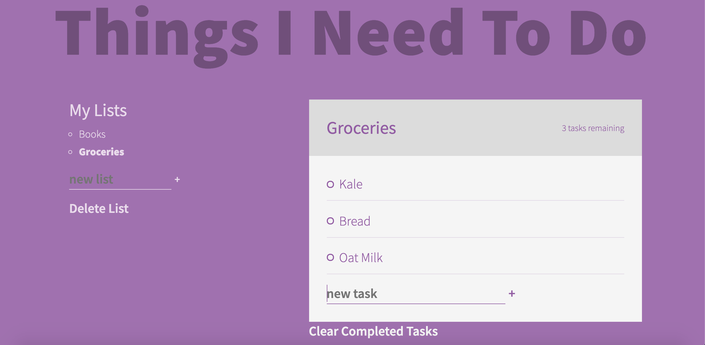

# To Do App

## Description

An incredibly dynamic todo list application that allows the user to track complex tasks that need to get done or items that need to be purchased.

## Some Features

* Multiple lists
* Toggle between lists
* Cross out completed tasks 
* Track tasks remaining
* Delete lists & tasks
* Information saved on reload

## Table of Contents

* [Project Summary](#description)
* [Preview](#preview)
* [Deployed App](#app)
* [Contact Me](#questions)
  
## Preview

Below is an example image of the app!

## App

Here is a link to the deployed app on GitHub Pages: 
[Todo App](https://habby-bit.github.io/ThingsToDo/)

## Questions?

If you have any questions, please don't hesitate to reach out!

Github: [habby-bit](https://github.com/habby-bit)
  
Email: [habbyolu@gmail.com](habbyolu@gmail.com)

